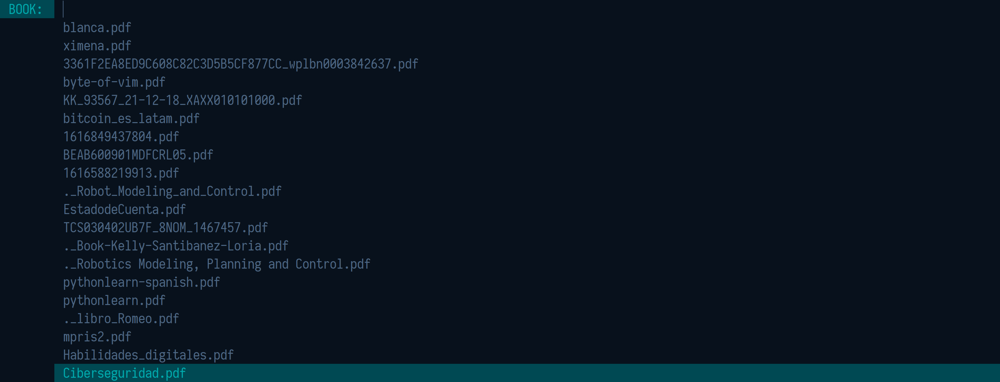

# Open PDF files using dmenu

In order to run this script you need to have installed

* zathura (document viewer) - **required**
* dmenu (dynamic menu) - **required**
* libnotify (notification daemon) - **optional**

Please edit the script file before you run it.

- The lines are specifically commented so you can change accordingly.

## Read pdf selector preview

## Notification
